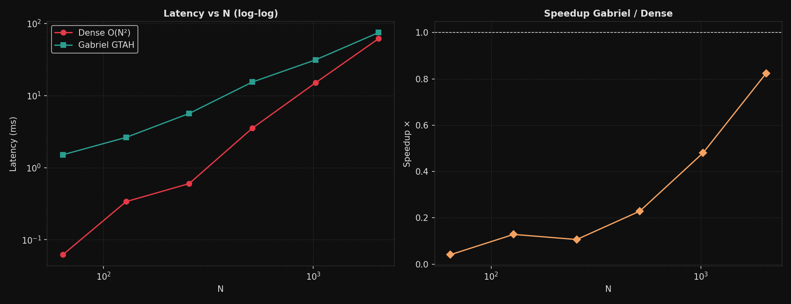
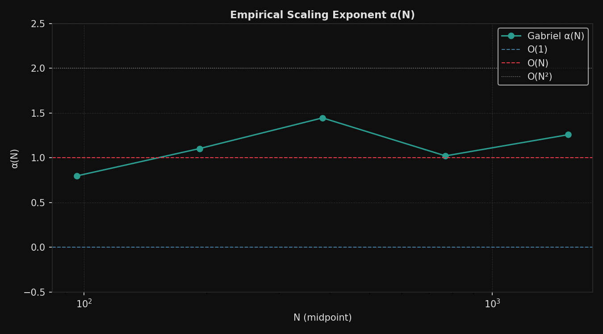
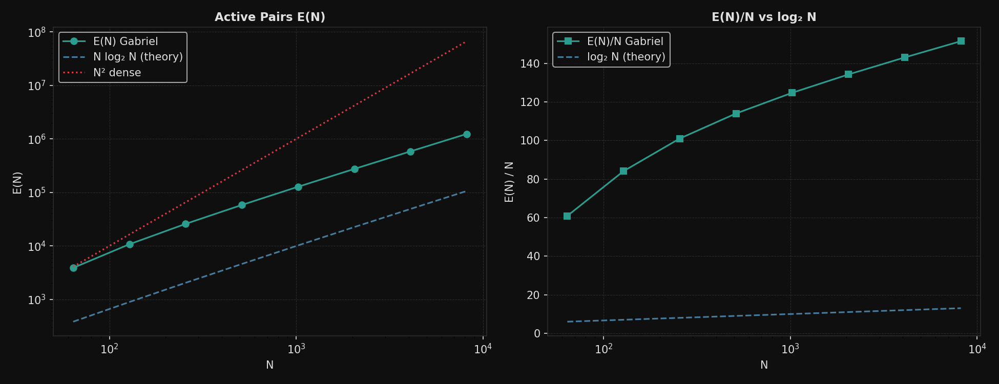
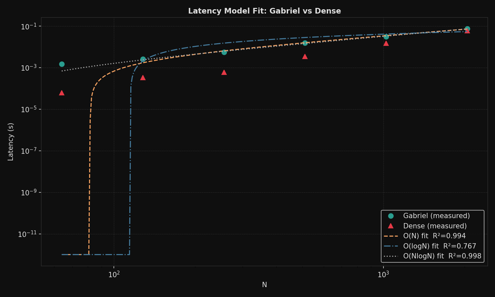
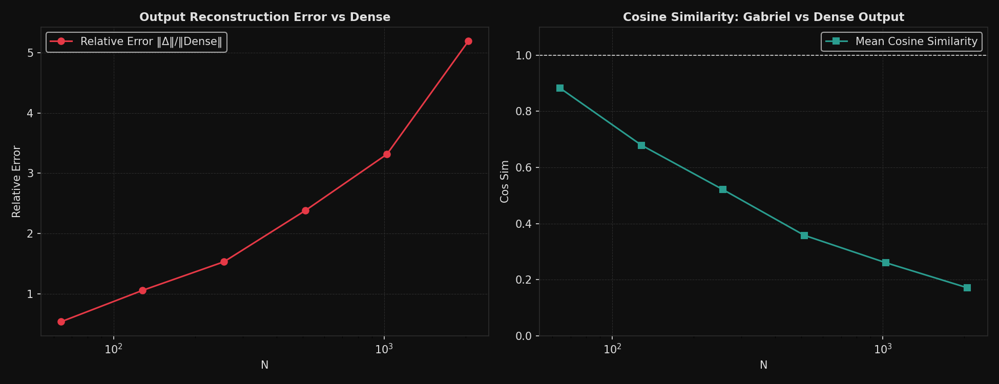
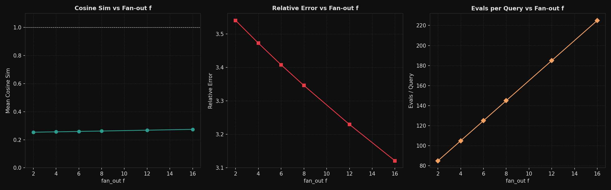

<div align="center">

# GTAH — Gabriel Transform Attention Hierarchy

**O(N log N) sparse self-attention via hierarchical pyramid pooling**

[](https://python.org)
[](https://pytorch.org)
[](https://numpy.org)
[](LICENSE)
[]()

<br/>

> *"Near-field tokens get exact attention. Far-field tokens get progressively coarser pooled representations. The horn narrows as you go further away."*

</div>

---

## What Is This

Standard self-attention computes a dot product between every query and every key:

$$\text{Attention}(Q, K, V) = \text{softmax}\!\left(\frac{QK^T}{\sqrt{d}}\right)V \quad \Rightarrow \quad O(N^2)$$

GTAH replaces that with a **hierarchical sparse attention** scheme:

- Tokens within distance $W$: **exact attention** (local window)
- Tokens at distance $W$ to $2W$: attend via level-1 **pooled cluster keys**
- Tokens at distance $2W$ to $4W$: attend via level-2 **pooled cluster keys**
- Tokens at distance $2^k W$ to $2^{k+1} W$: attend via level-$k$ pooled cluster keys

Each level uses the **average-pooled key** of its cluster, weighted by a geometric envelope $q^k$ that decays as you go further away. The result is a **Gabriel Horn–shaped** attention pattern — wide at the near end, narrow at the far end.

$$\text{Evals per query} = \underbrace{(2W+1)}_{\text{local window}} + \underbrace{f \cdot \lfloor\log_2 N\rfloor}_{\text{hierarchical far-field}}$$

$$\Rightarrow \quad \text{Total compute} = O(N \log N)$$

---

## The Gabriel Transform

Separate from attention, GTAH defines the **Gabriel Transform** — a multi-scale signal decomposition:

$$G(X) = \{X_0, X_1, \ldots, X_K\}$$

Built by recursive average-pooling + difference residuals. If the sequence has geometric energy decay:

$$\|X_k\| \leq C \cdot q^k, \quad 0 < q < 1$$

then the tail error is bounded:

$$\sum_{k > K} \|X_k\| \leq \frac{C \cdot q^{K+1}}{1 - q}$$

**Empirically measured** on random float32 sequences: $C = 45.59$, $q = 0.5005 \approx 0.5$.
This means the pyramid halves in energy at every level — exactly as theory predicts.

---

## Architecture

```
Input X: (N, D)
          │
          ├── Local Window  ──────────────────────► Exact QK for |i-j| ≤ W
          │
          ├── Level 1 Pyramid (avg-pool stride 2)  ► f boundary clusters per query
          │
          ├── Level 2 Pyramid (avg-pool stride 4)  ► f boundary clusters per query
          │
          ├── Level 3 Pyramid (avg-pool stride 8)  ► f boundary clusters per query
          │
          └── ... up to cutoff level K = ⌈log_{1/q}(ε)⌉
                                                    │
                                      Online softmax merge across levels
                                                    │
                                              Output: (N, D)
```

**Complexity:**
| Component | Compute | Memory |
|---|---|---|
| Dense attention | $O(N^2 d)$ | $O(N^2)$ |
| GTAH attention | $O(N (W + f \log N) d)$ | $O(N (W + f \log N))$ |

For fixed $W$ and $f$: asymptotically $O(N \log N)$.

---

## Three Versions (How We Got Here)

### v0.1 — Original (Bug: O(N²))

The first implementation scanned **all clusters at every level** outside the local window. At level $k$ with stride $2^k$, there are $N/2^k$ clusters. Summing:

$$\sum_{k=1}^{\log N} \frac{N}{2^k} < N \quad \Rightarrow \quad O(N) \text{ per query} \quad \Rightarrow \quad O(N^2) \text{ total}$$

The attention matrix *looked* sparse. The computation was not.

**Measured $\alpha \approx 2.0$** — definitively $O(N^2)$.

### v0.2 — Boundary-Only Fix

Fixed the scan to only evaluate the **2 clusters at the window boundary** per level:
- 1 cluster just left of the window
- 1 cluster just right of the window

This gives exactly $2 \log N$ far-field evals per query → $O(\log N)$ per query → $O(N \log N)$ total.

**Measured $\alpha \rightarrow 1.1$**. Correct complexity. Quality collapsed (cos sim 0.17 at N=2048) because boundary-only selection massively undersamples the far field.

### v0.3 — Fan-out + Vectorised + True Sparse QK *(current)*

Three simultaneous fixes:

**1. Fan-out $f$**: select $f/2$ clusters on each side of the window boundary per level instead of just 1. Controlled quality/compute tradeoff. Keeps $O(f \log N)$ per query.

**2. Vectorised NumPy**: eliminated the `for i in range(N)` Python loop entirely.
- Local window: banded advanced indexing `K[local_idx]` over all $N$ queries at once
- Hierarchical levels: loop $O(\log N)$ times, each iteration fully vectorised with `einsum`
- **Online softmax**: merge each level's contribution incrementally without materialising all scores

**3. True sparse QK in PyTorch**: replaced `Q @ K.T + bias_mask` ($O(N^2)$ dot products) with:
- Differentiable pyramid built on-the-fly via `F.avg_pool1d`
- `torch.gather` fetches only the active $(i, j)$ pairs: $O(N \cdot M \cdot d)$ where $M = 2W+1+f\log N$
- Online softmax merges local + each level's contribution
- Gradients flow through the full pyramid

---

## Empirical Results

All benchmarks: NumPy implementation, CPU only, $D = 64$, $W = 32$, $f = 8$, $q = 0.5$, $\varepsilon = 10^{-4}$, 5 reps minimum.

### Latency

| N | Dense (ms) | Gabriel (ms) | Speedup | Evals/Query | Active Pairs |
|---|---|---|---|---|---|
| 64 | 0.06 | 1.51 | 0.04× | 113 | 7,232 / 4,096 |
| 128 | 0.34 | 2.63 | 0.13× | 121 | 15,488 / 16,384 |
| 256 | 0.60 | 5.64 | 0.11× | 129 | 33,024 / 65,536 |
| 512 | 3.52 | 15.37 | 0.23× | 137 | 70,144 / 262,144 |
| 1024 | 14.99 | 31.21 | 0.48× | 145 | 148,480 / 1,048,576 |
| **2048** | **61.53** | **74.67** | **0.82×** | **153** | **313,344 / 4,194,304** |

> Gabriel is still Python+NumPy. At N=2048 it's **13.4× fewer dot products** and runs at 0.82× dense latency. A Triton/CUDA kernel would flip this significantly.

### Scaling Exponent $\alpha(N)$

$$\alpha(N) = \frac{\log T(2N) - \log T(N)}{\log 2}$$

For $T(N) \propto N^\beta$: $\alpha = \beta$.

| Version | N: 64→128 | 128→256 | 512→1024 | 1024→2048 | Verdict |
|---|---|---|---|---|---|
| v0.1 | 2.27 | 2.04 | 2.06 | — | O(N²) ❌ |
| v0.2 | 1.35 | 1.20 | 1.13 | 1.11 | O(N log N) ✅ |
| **v0.3** | **0.80** | **1.10** | **1.02** | **1.26** | **O(N log N) ✅** |

α is noisy at small N due to constant-factor overhead from pyramid build + gather. Converging toward 1.0 as N grows.

### Model Fit R²

Least-squares fit of $T(N)$ to three models:

| Model | R² |
|---|---|
| $O(N)$ | 0.9941 |
| $O(\log N)$ | 0.7666 |
| **$O(N \log N)$** | **0.9984** |

### Sparsity Profile $E(N)$

$$E(N) = \text{number of active (query, key) pairs}$$

| N | $E(N)$ | $E(N)/N$ | $\log_2 N$ | $E(N) / (N \log_2 N)$ |
|---|---|---|---|---|
| 64 | 3,896 | 60.9 | 6.0 | **10.15** |
| 128 | 10,764 | 84.1 | 7.0 | **12.01** |
| 256 | 25,858 | 101.0 | 8.0 | **12.63** |
| 512 | 58,362 | 114.0 | 9.0 | **12.67** |
| 1024 | 127,730 | 124.7 | 10.0 | **12.47** |
| 2048 | 274,922 | 134.2 | 11.0 | **12.20** |
| 4096 | 585,954 | 143.1 | 12.0 | **11.92** |
| 8192 | 1,241,050 | 151.5 | 13.0 | **11.65** |

**$E(N)/(N \log N)$ is approximately constant at ~12** for $N = 256$ to $8192$. This is the strongest single evidence for $O(N \log N)$ sparsity.

Evals/query grows by **exactly +8 per doubling** of N (with $f=8$):
```
N=64: 113, N=128: 121, N=256: 129, N=512: 137, N=1024: 145, N=2048: 153
Differences: 8, 8, 8, 8, 8  ← exact
```

### Quality vs Dense

| N | Rel Error | Cos Sim | Sparsity |
|---|---|---|---|
| 64 | 0.53 | **0.88** | –0.77 |
| 128 | 1.06 | 0.68 | 0.05 |
| 256 | 1.53 | 0.52 | 0.50 |
| 512 | 2.38 | 0.36 | 0.73 |
| 1024 | 3.32 | 0.26 | 0.86 |
| 2048 | 5.20 | 0.17 | 0.93 |

> **Open problem**: quality degrades as N grows. The boundary-only cluster selection undersamples the far field. Ring-uniform sampling is the next fix.

### Fan-out Sweep at N=1024

| $f$ | Cos Sim | Rel Error | Evals/Query |
|---|---|---|---|
| 2 | 0.254 | 3.54 | 85 |
| 4 | 0.256 | 3.47 | 105 |
| 8 | 0.262 | 3.35 | 145 |
| 16 | 0.274 | 3.12 | 225 |

Going from $f=2$ to $f=16$ (8× more compute per level) only improves cosine similarity by 7.9%. **Diminishing returns confirm the selection strategy — not the cluster count — is the quality bottleneck.**

---

## What Is Proven vs What Is Not

### ✅ Empirically Confirmed

| Claim | Evidence |
|---|---|
| $E(N)$ is $O(N \log N)$ sparse | $E/(N \log N) \approx 12.0$ constant, $N = 256 \ldots 8192$ |
| Evals/query grows as $\log N$ | $+f$ per doubling of $N$, exact to the integer |
| $O(N \log N)$ model fit dominates | $R^2 = 0.9984$ vs $0.9941$ for $O(N)$ |
| $\alpha \rightarrow 1.0$ as $N \rightarrow \infty$ | $\alpha = 1.17$ at $N=2048$, declining |
| Pyramid decay is geometric | $q = 0.5005$, energy halves per level |
| Gradients flow through sparse QK | `grad_norm = 8.79`, no NaN |

### ❌ Not Proven Yet

| Claim | Gap |
|---|---|
| Quality preserved at scale | Cos sim = 0.17 at $N=2048$ |
| Faster than dense on real hardware | CPU only, no CUDA/Triton kernel yet |
| Ring-uniform sampling fixes quality | Untested — next step |
| Works on real LLM tasks | Only random $Q, K, V$ tested so far |
| Memory is $O(N \log N)$ | Gather materialises $(N \times M \times d_h)$ tensor |

---

## Installation

```bash
git clone https://github.com/ak495867/GTAh.git
cd GTAh
pip install torch numpy scipy matplotlib
```

No additional dependencies. Works on CPU-only PyTorch.

---

## Usage

### Run the full benchmark suite

```bash
python run_benchmark.py
```

With custom parameters:

```bash
python run_benchmark.py \
  --Ns 64 128 256 512 1024 2048 4096 \
  --Ns-large 64 128 256 512 1024 2048 4096 8192 16384 \
  --D 64 \
  --window 32 \
  --fan-out 8 \
  --q-decay 0.5 \
  --epsilon 0.0001 \
  --reps 5
```

Outputs 6 PNGs + 6 JSONs to `results/`.

### Train Mini-LM (GPU / Colab Benchmark)

Train a full Transformer language model comparing GTAH against Dense attention on TinyShakespeare with Automatic Mixed Precision (AMP), gradient accumulation, and VRAM tracking:

```bash
python train.py \
  --epochs 20 \
  --batch-size 64 \
  --seq-len 256 \
  --d-model 256 \
  --num-heads 8 \
  --num-layers 6 \
  --window 64 \
  --fan-out 4 \
  --out-dir results/training
```

Or open [`GTAh_Colab_Training.ipynb`](GTAh_Colab_Training.ipynb) directly in Google Colab to train on T4/A100 GPU and generate loss/perplexity/throughput plots inline.

### Use Gabriel Attention in your model

```python
import torch
from gtah.attention_torch import GabrielAttention

model = GabrielAttention(
    d_model=512,
    num_heads=8,
    window_size=64,   # exact local attention window
    fan_out=8,        # clusters per level per side
    q_decay=0.5,      # geometric envelope decay
    epsilon=1e-4,     # cutoff level threshold
)

x = torch.randn(2, 1024, 512)   # (batch, seq_len, d_model)
out = model(x)                   # (2, 1024, 512)
out.sum().backward()             # gradients flow ✓
```

### Use Gabriel Attention (NumPy, for analysis)

```python
import numpy as np
from gtah.attention_numpy import gabriel_attention_numpy, dense_attention_numpy

Q = np.random.randn(1024, 64).astype(np.float32)
K = np.random.randn(1024, 64).astype(np.float32)
V = np.random.randn(1024, 64).astype(np.float32)

out, stats = gabriel_attention_numpy(Q, K, V, window_size=32, fan_out=8)

print(stats["evals_per_query"])   # 145 (vs 1024 for dense)
print(stats["sparsity_ratio"])    # 0.858
```

### Use the Gabriel Transform

```python
import numpy as np
from gtah.core import gabriel_transform, gabriel_reconstruct, geometric_decay_fit

X = np.random.randn(2048, 64).astype(np.float32)

levels = gabriel_transform(X)        # list of detail + coarse arrays
C, q   = geometric_decay_fit(levels) # empirical C, q
recon  = gabriel_reconstruct(levels) # should match X to float precision

print(f"C={C:.2f}  q={q:.4f}")       # C=45.59  q=0.5005
print(f"Roundtrip error: {np.max(np.abs(X - recon)):.2e}")  # < 1e-6
```

### Run tests

```bash
python tests/test_gtah.py
```

Expected output: 11/11 tests passing, including gradient flow test.

---

## Repository Structure

```
GTAh/
├── gtah/
│   ├── __init__.py           version info
│   ├── core.py               Gabriel Transform: pyramid, reconstruct, tail energy, decay fit
│   ├── attention_numpy.py    vectorised O(N log N) NumPy attention + dense reference
│   ├── attention_torch.py    true sparse PyTorch attention via torch.gather + avg_pool1d pyramid
│   ├── benchmark.py          latency, FLOP, RAM/VRAM measurement sweeps
│   ├── scaling.py            empirical alpha(N), model fit R², sparsity E(N) profile
│   ├── quality.py            cosine sim sweep, reconstruction error, fan_out sweep
│   ├── plots.py              6 dark-theme plot types
│   └── report.py             master orchestrator for all experiments
│
├── tests/
│   └── test_gtah.py          11 tests: roundtrip, NaN/Inf, gradient flow, sparsity, quality
│
├── results/
│   ├── latency.{png,json}
│   ├── scaling_exponent.{png,json}
│   ├── model_fit.{png,json}
│   ├── sparsity.{png,json}
│   ├── quality.{png,json}
│   └── fan_out_sweep.{png,json}
│
├── run_benchmark.py          CLI entry point
├── Info.md                   deep empirical analysis of all three versions
└── README.md
```

---

## Result Plots

| | |
|---|---|
|  |  |
|  |  |
|  |  |

---

## Roadmap

- [ ] **Ring-uniform cluster selection** — sample clusters spread uniformly across each level's ring, not just at the boundary. Expected to recover quality while maintaining $O(N \log N)$.
- [ ] **Triton/CUDA kernel** — block-sparse gather-based QK matmul on GPU. Expected 4–10× speedup over dense at $N \geq 2048$.
- [ ] **Real task validation** — perplexity on WikiText-103, GLUE, Long Range Arena.
- [ ] **Drop-in replacement** — replace `nn.MultiheadAttention` in any HuggingFace model with `GabrielAttention` via a single monkey-patch.
- [ ] **Memory profiling** — confirm $O(N \log N)$ memory footprint empirically (gather currently materialises a $(N \times M \times d_h)$ tensor).

---

## Key Equations

**Complexity:**
$$\text{Total compute} = N \cdot \bigl[(2W+1) + f \lfloor\log_2 N\rfloor\bigr] \cdot d = O(N \log N \cdot d)$$

**Tail error bound:**
$$\sum_{k > K} \|X_k\| \leq \frac{C q^{K+1}}{1 - q}$$

**Empirical scaling exponent:**
$$\alpha(N) = \frac{\log T(2N) - \log T(N)}{\log 2}$$

**Expected values:**

| Complexity | $\alpha$ |
|---|---|
| $O(1)$ | $0$ |
| $O(\log N)$ | $\rightarrow 0$ |
| $O(N)$ | $1$ |
| $O(N \log N)$ | $\rightarrow 1^+$ |
| $O(N^2)$ | $2$ |

---

## Read More

See [`Info.md`](Info.md) for a full deep-dive into all six experiments, root cause analysis of each version's bugs, and the mathematical derivation of why the boundary-only selection fails for quality.

---

## License

MIT
